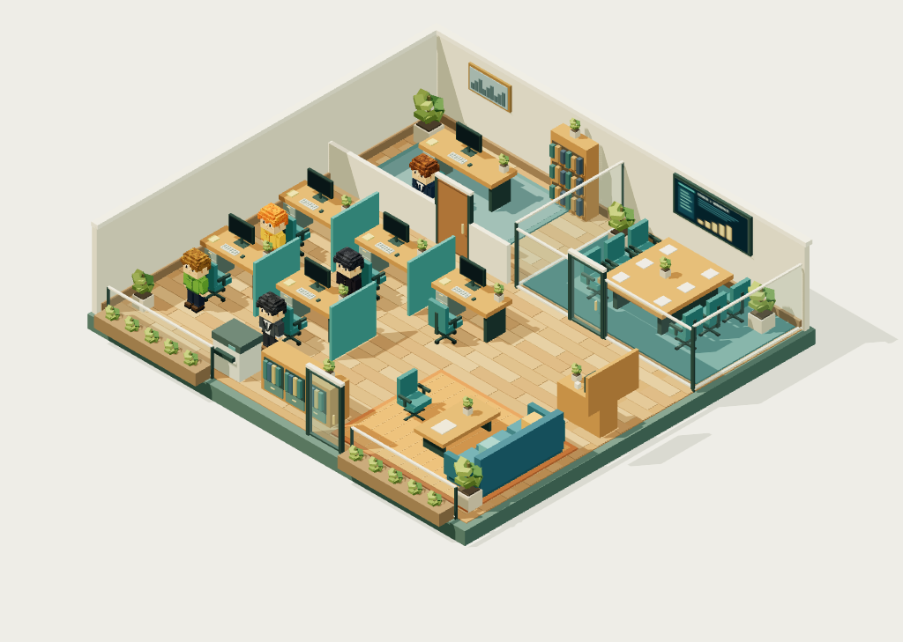

# Hermes Virtue Office

An isometric 3D office for **Hermes Agent**, with five voxel character styles, animated workstations, a meeting room, lounge and automatic doors. Inspired by [Hermes Pixel Office](https://github.com/teknium1/hermes-pixel-office), using the Virtue office design.



## Install in Hermes

Requires Python 3.10+ and a Hermes Agent version supporting plugin lifecycle, tool, subagent and approval hooks. In your terminal:

```sh
git clone https://github.com/uchup07/hermes-virtue-office.git ~/.hermes/plugins/virtue-office
hermes plugins enable virtue-office
```

Configure a password as described below. Start a **new Hermes session**, then open **http://127.0.0.1:8114**. The server starts when the plugin receives its first session event. For a custom Hermes profile, clone into `$HERMES_HOME/plugins/virtue-office` instead.

The office observes Hermes; approval decisions are still made in Hermes. A character is assigned to each session, with separate characters for subagents.

## Keep a public office online (Docker/VPS)

For an office that remains accessible without any active Hermes session, run the included **separate Docker viewer**. Follow [the Docker deployment guide](deploy/DOCKER.md). It includes shared state, password-file configuration, automatic restart and proxy instructions. Set the Hermes plugin `server_mode: external` when using this deployment. The default embedded viewer ends when its host Hermes process exits.

## Password-protected access

All office pages, JavaScript, models and `/state` require a login. When no password is configured, the office stays locked and the standalone server refuses to start. `/health` remains public for a minimal service check.

Create a private password file on the machine running Hermes (the password prompt hides what you type):

```sh
python3 - <<'PYTHON'
from getpass import getpass
from pathlib import Path
import os
password = getpass("Office password: ")
if not password or password != getpass("Confirm password: "):
    raise SystemExit("Passwords must match and cannot be empty")
path = Path.home() / ".hermes" / "virtue-office-password"
path.parent.mkdir(parents=True, exist_ok=True)
fd = os.open(path, os.O_WRONLY | os.O_CREAT | os.O_TRUNC, 0o600)
os.fchmod(fd, 0o600)
with os.fdopen(fd, "w") as file:
    file.write(password)
print("Password saved to", path)
PYTHON
export VIRTUE_OFFICE_PASSWORD_FILE="$HOME/.hermes/virtue-office-password"
```

Run Hermes or `python3 serve.py --demo` from that environment, then open the office and enter the password. Alternatively, provide `VIRTUE_OFFICE_PASSWORD` through your service's secret/environment configuration. The file setting takes precedence if both are provided. Do not commit a password or password file to Git. A service manager must receive the same environment setting; an export in a separate terminal does not update an already running service.

Login sessions last eight hours. **Keluar** invalidates the session immediately. Restart the office server after changing the password; restarting also invalidates all existing sessions. Password verification uses PBKDF2-SHA256, sessions use random server-side tokens, and login allows five attempts per minute per server.

For public access, serve the office through an **HTTPS reverse proxy** pointing to `127.0.0.1:8114`. Preserve the existing local upstream Host header (`127.0.0.1:8114`) and set `X-Forwarded-Proto: https` so cookies have the Secure flag. The proxy must forward `/login`, `/logout`, `/state` and static routes to the Python server; serving the `web/` folder directly bypasses its login checks. The application still binds to loopback.

## Try without Hermes

```sh
cd hermes-virtue-office
python3 serve.py --demo
```

Open **http://127.0.0.1:8114**. The clearly marked demo generates synthetic tool calls, subagents and approval requests in a temporary database. It does not change Hermes configuration or real session data. Stop with Ctrl+C.

No package installation, Node.js or external CDN is needed to run the viewer. Use a modern browser with WebGL2 support.

## Two modes

- **Live office:** characters enter, walk to a seat, turn on their monitor and animate according to tool activity. Reading, typing, browsing, terminal work, waiting for approval and session completion have distinct states. Doors open as characters approach. Click a character or roster entry to focus it.
- **Playground:** click **Coba kontrol karakter** to try manual movement, sitting, work tasks, computer power and doors. This is a separate sandbox and does not control Hermes.

Idle agents walk to the lower-right lounge, sit on the sofa/chair or wait beside the coffee table. Their assigned work seat stays reserved; new activity sends them back to that same seat. Thinking, active tools and approval requests remain at the workstations.

Speech bubbles describe each character's current activity in Indonesian. A new command/event shows the bubble for two seconds, then it hides until another event arrives. Repeated polling, camera movement, selection and character arrival do not restart this timer. Live bubbles follow Hermes tool/lifecycle metadata (they do not reveal prompts or tool arguments); approval requests have an amber bubble. In the playground, bubbles follow walking, sitting, computer power, door interactions and task completion.

Right-drag rotates the camera; scroll zooms. The isometric button resets the view. Pause affects animation only. Sound notifications are opt-in.

The office has 12 visible seats. Additional sessions remain in the roster and enter when a seat becomes available. The five appearances are assigned consistently from session IDs, so different sessions can share a character style.

## Configuration

Optional port setting in Hermes `config.yaml` (merge with your existing plugin configuration):

```yaml
plugins:
  enabled:
    - virtue-office
  entries:
    virtue-office:
      port: 8114
```

For a standalone viewer connected to the same state directory:

```sh
python3 serve.py --port 8114
```

Use `--data-dir /path/to/virtue-office` for an explicit state directory. `--demo` always uses isolated temporary data. Separate Hermes profiles should use distinct ports.

## Integration and local data

`register(ctx)` observes these hooks:

| Hermes hook | Office response |
| --- | --- |
| `on_session_start` / `on_session_end` | Enter / leave office |
| `pre_tool_call` / `post_tool_call` | Work animation and completion count |
| `subagent_start` / `subagent_stop` | Child agent enters / leaves |
| `pre_approval_request` / `post_approval_response` | Waiting indicator / resume |

State is shared across local Hermes processes through SQLite at `$HERMES_HOME/virtue-office/state.sqlite3` (default `~/.hermes/virtue-office/state.sqlite3`). Stored metadata includes session IDs, role labels, tool names, timestamps and counters. Prompts, tool arguments, commands, results and raw error messages are not stored. Recent history is bounded to 500 events.

The HTTP server binds to `127.0.0.1`, rejects foreign Host headers, exposes only login/logout POST endpoints (no Hermes write actions) and serves bundled assets. Plugin failures return without blocking Hermes. The browser polls `/state`; `/health` identifies the service. The demo is labelled separately from live activity.

## Validation and limits

```sh
python3 -m unittest discover -s tests -v
npm test
```

Tests cover hook registration, approval and lifecycle mapping, shared state across processes, database contention, server takeover, static-file containment, read-only HTTP behavior, character navigation, login enforcement, wrong passwords, CSRF protection, rate limits, session expiry and logout. CI runs these checks on pushes and pull requests.

The implementation was checked against the Hermes plugin API at commit `1744a19e0df568c647e4f3ff9c37f2a284a282fb`, with simulated hook payloads and a browser demo. A real Hermes/LLM session has not been run in this development environment; compatibility with other Hermes revisions may require adjustments.

Animations are procedural in the browser; the bundled GLB characters are models, not a baked animation library. If a Hermes process crashes without an end event, its last state can remain until expiry (24 hours). Approval events without a session ID use the active hook context when available, otherwise a process-level identity. In embedded mode, closing the process hosting the viewer interrupts it until another active process receives an event and takes over. Use the separate Docker viewer for persistent public access.

## Credits

Integration reference: [Teknium / Nous Research — Hermes Pixel Office](https://github.com/teknium1/hermes-pixel-office). Renderer: [Three.js](https://threejs.org/), bundled locally under MIT. See [LICENSE](LICENSE) and [third-party notices](THIRD_PARTY_NOTICES.md).
